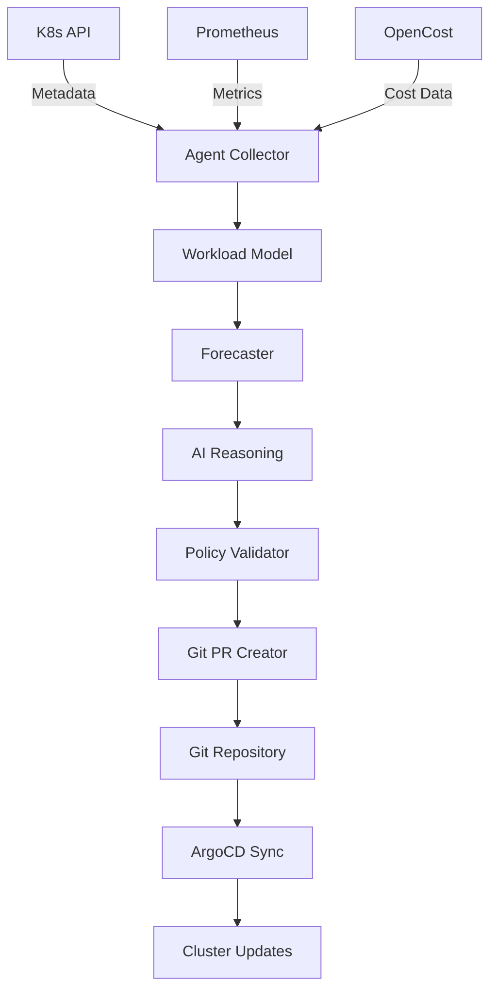

# Architecture

System architecture for Watchdog Agents.

## The 7-step Optimization Lifecycle
1. Data Collection
2. Infrastructure Understanding
3. Forecasting
4. AI Reasoning
5. Policy Validation
6. GitOps Deployment
7. Progressive Delivery

## Component Map
- `internal/k8s` — Kubernetes API client (deployments, workload discovery)
- `internal/telemetry` — Prometheus PromQL client (CPU, memory, network metrics)
- `internal/finops` — OpenCost REST client (cost allocation per namespace/pod)
- `internal/config` — [PLANNED] Configuration loading from config.yaml
- `internal/scheduler` — [PLANNED] Reconciliation loop (periodic data collection + analysis)
- `internal/policy` — [PLANNED] OPA/Kyverno policy validation
- `internal/reasoning` — [PLANNED] AI reasoning engine (LangGraph)
- `internal/gitops` — [PLANNED] Git PR generation and management

## Data Flow
K8s API + Prometheus + OpenCost → Agent collects → Builds workload model → Forecasts → AI reasons → Policy validates → Git PR created → ArgoCD deploys

## Infrastructure
ArgoCD manages deployments, Prometheus Stack for monitoring, OpenCost for cost data.

